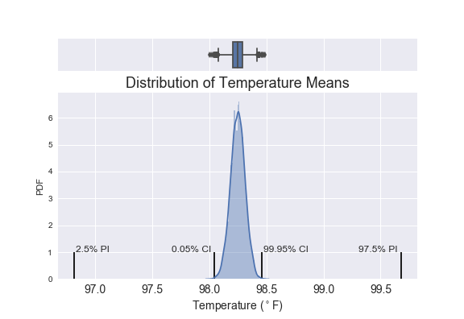

# What is the True Normal Human Body Temperature? 

EXERCISES FOR THE SPRINGBOARD DATA SCIENCE INTENSIVE

---
### Background

The mean normal body temperature was held to be 37$^{\circ}$C or 98.6$^{\circ}$F for more than 120 years since it was first conceptualized and reported by Carl Wunderlich in a famous 1868 book. But, is this value statistically correct?

---
### The Data
* Available Here: http://www.amstat.org/publications/jse/jse_data_archive.htm (Scroll down about 3/4 of the page.)

* More Information: http://www.amstat.org/publications/jse/datasets/normtemp.txt

---
### Analyze a dataset of human body temperatures and employ the concepts of hypothesis testing, confidence intervals, and statistical significance. 
Answer the following questions:
<ol>
    <li>Is the distribution of body temperatures normal?</li> 
       
    <li>Is the sample size large? Are the observations independent?</li> 
    
    <li>Is the true population mean really 98.6 degrees F?</li>
    <ul>
        <li> Is it best to use a one-sample or two-sample test? Why?
        <li> In this situation, is it appropriate to use the $t$ or $z$ statistic? 
        <li> Try using the other test. How is the result different? Why?
    </ul> 

    <li>Draw a small sample of size 10 from the data and repeat both tests.</li>
    <ul>
        <li> Which one is the correct one to use? 
        <li> What is noticeable? What does this say about the difference in application of the $t$ and $z$ statistic?
    </ul> 
    
    <li>At what temperature should we consider someone's temperature to be "abnormal"?</li> 
    
    <li>Is there a significant difference between males and females in normal temperature?</li>
    <ul>
        <li>What test is used and why?</li>
    </ul>
   
</ol>

### Write a story with a conclusion in the context of the original problem.

---

## APPROACH
<ol>
<li>[Is the distribution of body temperatures normal?](#one)</li>

A CDF was constructed to determine whether the distribution of human body temperature is normal:

    
 
    
<li>[Is the sample size large? Are the observations independent?](#two)</li>

The length of the temperature data column was retrieved to determine the sample size, 130, which is large. The temperature observations are independent, as they are not influenced by and reveal no information about any other observation.
 
    
<li>[Is the true population mean really 98.6 degrees F?](#three)</li>

A one-sample test was used since one set of data was compared to a single value. For this situation, it was best to use a t-statistic since the population standard deviation is unknown. Though a t-test is best for small samples, it becomes similar to the z-test with large samples, so the results did not differ much using a z-statistic, which was estimated using the standard error of the mean.

        

In every test the p-value is significantly less than 0.01, so the null hypothesis was rejected.
 

<li>[Draw a small sample of size 10 from the data and repeat both tests.](#four)</li>

Since the population standard deviation is unkown and the sample size is small, the t-test was again chosen as the most appropriate. However, the z-test returned the most significant results.
 
    
<li>[At what temperature should we consider someone's temperature to be "abnormal"?](#five)</li>

A look at the 95% and 99.9% confidence intervals left skepticism that abnormal human body temperature could be determined from analysis of this data.
 
    
<li>[Is there a significant difference between males and females in normal temperature?](#six)</li>

A two-sample t-test returned a t-statistic of 2.29 and p-value of 0.024, so here too, the null hypothesis is rejected. There is a difference in human body temperatures between females and males.

</ol>

## FINAL RESULTS

### What is the True Normal Human Body Temperature?

That is a good question, but it likely isn't the conventional value of 98.6$^{\circ}$F.

There is sufficient evidence to warrant rejection of the claim that the true population mean is the conventional normal human body temperature of 98.6$^{\circ}$F. Though this value was rejected as the true population mean, values outside the confidence interval should not be rejected as plausible normal body temperatures.

The difference in human body temperatures between females and males, though significant, is not extreme. Women tend to have a slightly higher body temperature.

### And, What About the Relationship with Heart Rate?

There is a positive and significant correlation between human body temperature and heart rate, which seems to be more reliable the more normal the human body temperature.

## REPORTS
* [Normal Body Temperature EDA](normal_body_temp_eda.ipynb)
