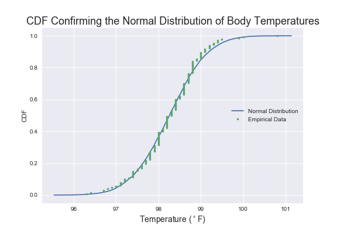
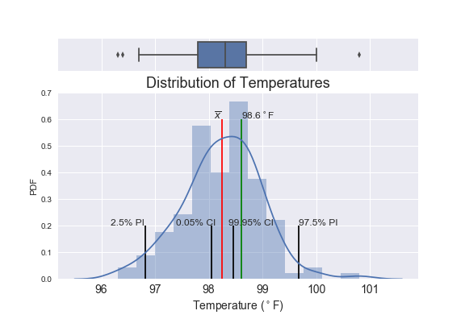
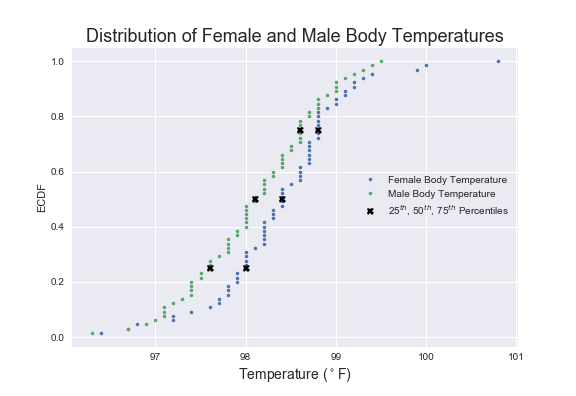
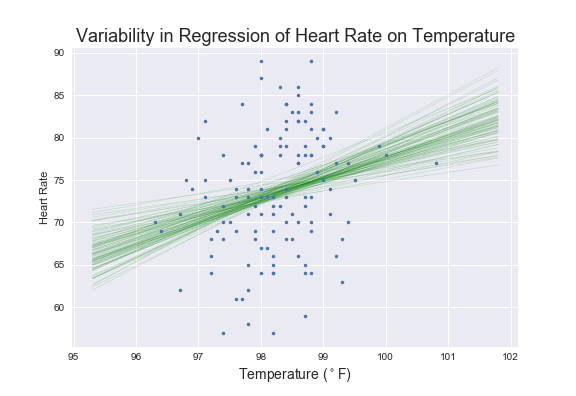

## What is the True Normal Human Body Temperature? 

EXERCISES FOR THE SPRINGBOARD DATA SCIENCE INTENSIVE

---
### Background

The mean normal body temperature was held to be 37°C or 98.6°F for more than 120 years after it was first conceptualized and reported by Carl Wunderlich in a famous 1868 book. But, is this value statistically correct?

---
### The Data
* Available Here: http://www.amstat.org/publications/jse/jse_data_archive.htm (Scroll down about 3/4 of the page.)

* More Information: http://www.amstat.org/publications/jse/datasets/normtemp.txt

---
### Analyze a dataset of human body temperatures and employ the concepts of hypothesis testing, confidence intervals, and statistical significance. 

ANSWER THE FOLLOWING QUESTIONS:

**Is the distribution of body temperatures normal?**

* A CDF was constructed to determine whether the distribution of human body temperature is normal:
    

    
**Is the sample size large? Are the observations independent?**

* The length of the temperature data column was retrieved to determine the sample size, 130, which is large. The temperature observations are independent, as each value for temperature represents a distinct measure of such.

    
**Is the true population mean really 98.6°F?**

* A one-sample test was used since one set of data was compared to a single value. For this situation, it was best to use a t-statistic since the population standard deviation is unknown. Though a t-test is best for small samples, it becomes similar to the z-test with large samples, so the results did not differ much using a z-statistic, which was estimated using the standard error of the mean.

        
* In every test the p-value is markedly less than the chosen significance level of 0.01, so the null hypothesis that the true population mean is equal to the conventional mean (98.6°F) was rejected.

**Draw a sample of size 10 from the data and repeat both tests.**

* Since the population standard deviation is unkown and the sample size is small, the t-test was chosen again as the most appropriate. However, the z-test returned the most significant results, as it is the most sensitive of the two.
    
**At what value is one's temperature considered 'abnormal'?**

* A look at the 95% and 99.9% confidence intervals left skepticism that abnormal human body temperature could be determined from analysis of this data. That's because looking at the confidence interval was the incorrect approach. A 95% prediction interval indicates temperatures below 96.8°F or higher than 99.7°F may be considered abnormal.
    
**Is there a significant difference between males and females in normal temperature?**

* A two-sample t-test returned a t-statistic of 2.29 and p-value of 0.024, so here too, the null hypothesis was rejected. There is a difference in human body temperatures between females and males.

## FINAL RESULTS

### What is the True Normal Human Body Temperature?

That's a good question, but it likely isn't the conventional value of 98.6°F. The average temperature from this study is 98.2°F, so perhaps that is the true normal human body temperature. 

Nonetheless, there is sufficient evidence to warrant rejection of the claim that the true population average is the conventional normal human body temperature of 98.6°F. Though it's a likely value:

The difference in human body temperatures between females and males, though significant, is not extreme. Women tend to have a slightly higher body temperature:

### And, What About the Relationship with Heart Rate?

There certainly appears to be a relationship. In fact, there is a positive correlation between human body temperature and heart rate:

## REPORTS
[Normal Body Temperature EDA](http://nbviewer.jupyter.org/github/humburgc/normal_body_temp_eda/blob/master/normal_body_temp_eda.ipynb)